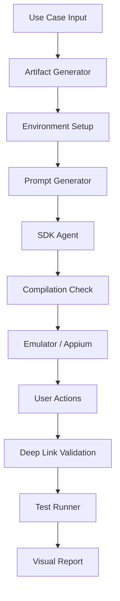

# Pipeline Automation MCP

Pipeline Automation MCP is a workflow-driven automation platform for validating mobile SDK integrations end to end. It combines a LangGraph orchestration layer, LLM-powered agents, sandboxed application preparation, emulator and Appium-based execution, and generated audit reports to help teams verify AppsFlyer-style SDK integrations for iOS and Android.

## Overview

The goal of this system is to evaluate how reliably an LLM agent can understand integration tasks, select and execute the appropriate MCP tools, apply required changes, and validate the final outcome.

Instead of manually evaluating whether an AI agent correctly performs a complex software integration workflow, the pipeline creates a repeatable evaluation environment where each agent run can be observed, validated, and measured.

Each execution represents a complete agent evaluation cycle:

- A structured use case is provided to the system.
- The workflow initializes an isolated execution environment.
- The LLM agent receives context and performs integration actions through MCP tools.
- The target application is modified and validated.
- Execution evidence, tool usage, logs, and validation results are collected.
- A final report is generated describing the success or failure of the agent execution.

The SDK integration domain serves as the testing environment, while the primary objective is measuring the reliability and effectiveness of autonomous LLM-driven workflows.


## Key capabilities

- Use-case driven orchestration for iOS and Android flows
- Isolated sandboxed app preparation for each run
- Prompt generation and SDK-agent execution using LLMs and MCP tools
- Compilation and environment validation steps
- Emulator/Appium-based interaction checks for deep-link and UI behavior
- Structured audit logging and HTML reports for downstream review
- A Streamlit-based UI for selecting and launching runs

## Architecture

The repository is organized around a central workflow engine that coordinates multiple specialist components.



### Core components

- UI layer: [ui/app.py](ui/app.py)
  - Provides the Streamlit experience for selecting use cases, configuring runs, and launching the workflow.

- Use-case service: [infra/use_case_service](infra/use_case_service)
  - Loads, validates, and serializes use cases through the schema and repository layer.

- Workflow engine: [infra/workflow](infra/workflow)
  - Defines the LangGraph pipeline, node routing, run initialization, and teardown behavior.

- Agent layer: [infra/agents](infra/agents)
  - Includes the prompt generator, SDK integration agent, answer agent, compilation agent, and user-action helpers.

- Runtime and validation services: [infra/application](infra/application) and [infra/reports](infra/reports)
  - Provision sandboxes, verify application readiness, run MCP and emulator checks, and render HTML reports.

## Execution flow

A typical run follows this path:

1. A use case is selected from the catalog or from the UI state.
2. The workflow initializes the run and creates a sandbox copy of the target app.
3. Prompt-generation and SDK-agent nodes prepare the execution context and invoke MCP-backed integration tools.
4. The pipeline performs compilation and runtime validation steps.
5. Emulator/Appium-driven actions and deep-link checks may be executed when required by the use case policy.
6. The run concludes with a report that summarizes the evidence and outcome.

The workflow state is intentionally shared across nodes so each step can read the latest platform, app path, selected use case, credentials, audit logs, and agent outputs.

## State and data model

The pipeline relies on a shared state object that carries:

- run identifiers and selected use cases,
- platform selection such as iOS or Android,
- sandbox and application paths,
- answer policy and prompt data,
- audit recorder and node execution history,
- validation results and report metadata.

This state-driven design keeps the graph deterministic and makes the run inspectable at every stage.

## Project layout

```text
infra/                 Core workflow, agents, services, and runtime helpers
ui/                    Streamlit UI entry point
data/                  Use cases, sample apps, rules, and runtime artifacts
scripts/               Operational helpers and run utilities
tests/                 Automated tests for the workflow and agent behavior
sandboxes/             Isolated sandbox copies created during runs
```

## Development and execution

### Prerequisites

- Python 3.10+
- Node.js for the MCP server execution path
- Mobile build tooling for the target platform
  - Android: Android SDK, Gradle, emulator tooling
  - iOS: Xcode and simulator tooling

### Local setup

1. Create and activate a virtual environment.
2. Install the project dependencies from [pyproject.toml](pyproject.toml).
3. Create a repository-root [.env](.env) file with the required environment values for LLM access and the AppsFlyer/MCP integration layer.
4. Launch the UI with Streamlit or run the manual entry point for experimentation.

### Common entry points

- [ui/app.py](ui/app.py) for the interactive UI
- [main.py](main.py) for manual agent and workflow experimentation
- [infra/workflow/run_launcher.py](infra/workflow/run_launcher.py) for launching a workflow run from the automation layer

## Testing

The repository includes automated tests under [tests](tests) that cover UI-facing and workflow-oriented behaviors. The suite should be run from the project root after installing the development dependencies.

## Notes

- Local-only files such as [.env](.env), runtime data under [data/runs](data/runs), and sandbox folders under [sandboxes](sandboxes) are expected during normal execution and should not be treated as source artifacts.
- The project is intentionally workflow-oriented and agent-driven; it is designed for automation and validation rather than as a traditional CRUD-style web application.